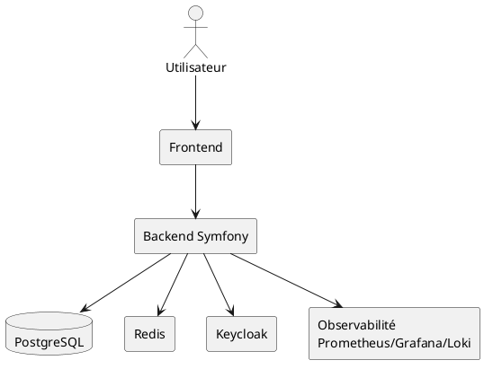

# 07 — Architecture technique

## Schéma de haut niveau (ASCII)
```text
[Utilisateur Web/Mobile]
          |
          v
    [CDN + WAF]
          |
          v
   [Frontend Twig/JS]
          |
          v
 [Backend Symfony API/MVC] ----> [Keycloak]
      |           |                  |
      |           +------------------+
      v
 [PostgreSQL]   [Redis Cache]
      |
      v
 [Prometheus + Grafana + Loki]
      |
      v
 [Alertmanager / Email / Slack]
```

## Variante PlantUML


## Description des composants
- **Frontend** : rendu Twig + JS pour catalogue, panier, espace communauté.
- **Backend Symfony (MVC/API)** : logique métier, endpoints REST, orchestration des services.
- **PostgreSQL** : persistance transactionnelle (produits, commandes, utilisateurs).
- **Redis** : cache des sessions et données chaudes.
- **Keycloak** : IAM/SSO, fédération d’identités, gestion des rôles.
- **Stack observabilité** : métriques, logs centralisés, dashboards, alertes.

## Choix d’architecture
- Approche modulaire monolithe (POC) pour limiter complexité initiale.
- Externalisation IAM et observabilité pour préparer passage à l’échelle.
